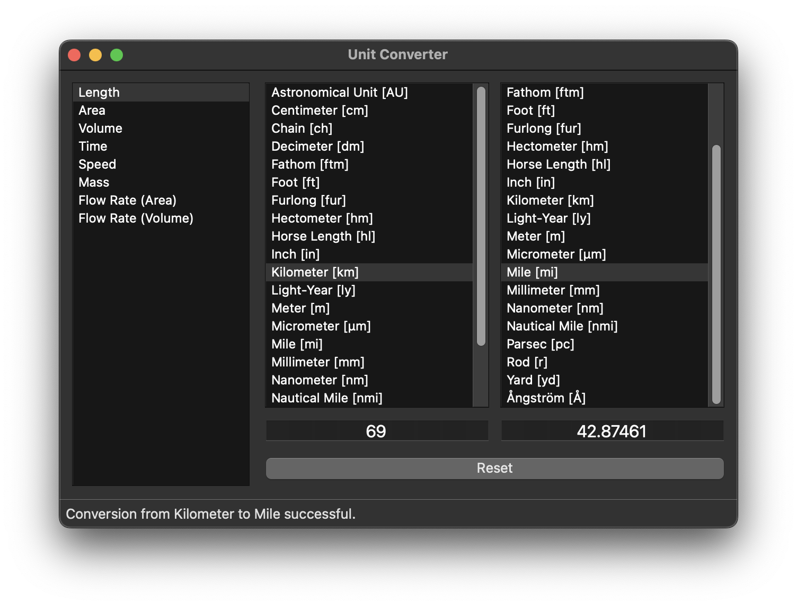

# Unit Converter – Rewrite

A rewrite of the original unit converter at: https://github.com/JDCRecomendable/unit-converter.

## Roadmap

* [X] Migrate to PySide6
* [X] Vibe code parts of the rewrite
* [ ] Add the remaining 300+ units from the original implementation
* [ ] Display SI units at the top
* [ ] Enable users to round off 😱
* [ ] Enable users to filter through units
* [ ] Enable users to add and save custom units through the GUI
* [ ] Enable users to bulk add custom units using JSON
* [ ] Enable users to bulk add custom units using YAML
